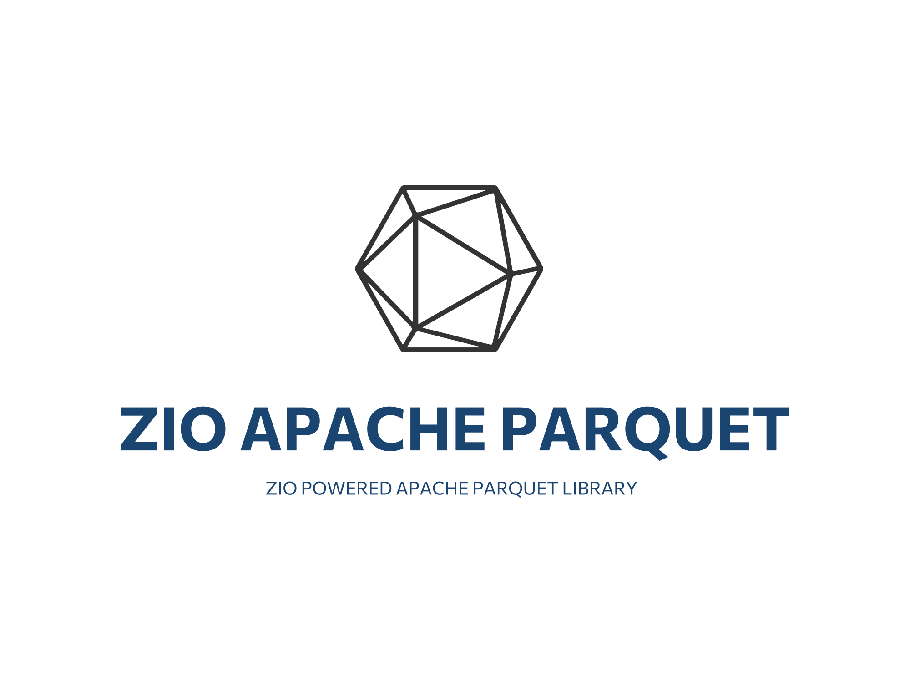

[](https://scala-steward.org)

# ZIO Apache Parquet

A ZIO-powered wrapper for [Apache Parquet's Java implementation](https://github.com/apache/parquet-mr), leveraging [ZIO Schema](https://zio.dev/zio-schema/) to automatically derive codecs and provide type-safe filter predicates. Operate your parquet files easily using a top-notch ZIO-powered ecosystem without running a Spark cluster.

Ready for more? Check out my other game-changing library that makes working with Apache Arrow format a breeze - [ZIO Apache Arrow](https://github.com/grouzen/zio-apache-arrow).

## Why?

- **No Spark required** - you don't need to run a Spark cluster to read/write Parquet files.
- **ZIO native** - utilizes various ZIO features to offer a FP-oriented way of working with the Parquet API.
- **ZIO Schema** - the backbone that powers all the cool features of this library such as type-safe filter predicates and codecs derivation.


## Contents

- [Installation](#installation)
- [Usage](#usage)
  - [Codecs](#codecs)
    - [Schema](#schema)
    - [Value](#value)
  - [Reading & Writing files](#reading--writing-files)
    - [Filtering](#filtering)
- [Resources](#resources)

## Installation

```scala
libraryDependencies += "me.mnedokushev" %% "zio-apache-parquet-core" % "@VERSION@"
```

## Usage

All examples are self-contained [Scala CLI](https://scala-cli.virtuslab.org) snippets. You can find copies of them in `docs/scala-cli`.

### Codecs

To be able to write/read data to/from parquet files you need to define the following schema and value codecs 
`SchemaEncoder`, `ValueEncoder`, and `ValueDecoder` for your case classes.

#### Schema

You can get Java SDK's `Type` by using `SchemaEncoder` generated by `SchemaEncoderDeriver.default` ZIO Schema deriver:

```scala
//> using scala "3.5.0"
//> using dep me.mnedokushev::zio-apache-parquet-core:0.1.0

import zio.schema.*
import me.mnedokushev.zio.apache.parquet.core.codec.*

object Schema extends App:

  case class MyRecord(a: Int, b: String, c: Option[Long])
  object MyRecord {
    given schema: Schema[MyRecord]               =
      DeriveSchema.gen[MyRecord]
    given schemaEncoder: SchemaEncoder[MyRecord] =
      Derive.derive[SchemaEncoder, MyRecord](SchemaEncoderDeriver.default)
  }

  val parquetSchema = MyRecord.schemaEncoder.encode(MyRecord.schema, "my_record", optional = false)

  println(parquetSchema)
  // Outputs:
  // required group my_record {
  //   required int32 a (INTEGER(32,true));
  //   required binary b (STRING);
  //   optional int64 c (INTEGER(64,true));
  // }
```

Alternatively, you can customize the schemas of [primitive](https://zio.dev/zio-schema/standard-type-reference) fields within your record by defining a custom `SchemaEncoder` 
and using the `SchemaEncoderDeriver.summoned` deriver.

```scala
//> using scala "3.5.0"
//> using dep me.mnedokushev::zio-apache-parquet-core:0.1.0

import me.mnedokushev.zio.apache.parquet.core.Schemas
import zio.schema._
import me.mnedokushev.zio.apache.parquet.core.codec._

object SchemaSummoned extends App:

  case class MyRecord(a: Int, b: String, c: Option[Long])

  object MyRecord:
    given schema: Schema[MyRecord] =
      DeriveSchema.gen[MyRecord]
    // The custom encoder must be defined before the definition for your record type.
    given SchemaEncoder[Int] with {
      override def encode(schema: Schema[Int], name: String, optional: Boolean) =
        Schemas.uuid.optionality(optional).named(name)
    }
    given schemaEncoder: SchemaEncoder[MyRecord] =
      Derive.derive[SchemaEncoder, MyRecord](SchemaEncoderDeriver.summoned)

  val parquetSchema = MyRecord.schemaEncoder.encode(MyRecord.schema, "my_record", optional = false)

  println(parquetSchema)
  // Outputs:
  // required group my_record {
  //   required fixed_len_byte_array(16) a (UUID);
  //   required binary b (STRING);
  //   optional int64 c (INTEGER(64,true));
  // }
```

#### Value

`Value` is a sealed hierarchy of types for interop between Scala values and Parquet readers/writers.
For converting Scala values into `Value` and back we need to define instances of `ValueEncoder` and `ValueDecoder`
type classes. This could be done by using `ValueDecoderDeriver.default` ZIO Schema deriver.

```scala
//> using scala "3.5.0"
//> using dep me.mnedokushev::zio-apache-parquet-core:0.1.0

import zio.schema._
import me.mnedokushev.zio.apache.parquet.core.codec._

object Value extends App:

  case class MyRecord(a: Int, b: String, c: Option[Long])

  object MyRecord:
    given Schema[MyRecord]                =
      DeriveSchema.gen[MyRecord]
    given encoder: ValueEncoder[MyRecord] =
      Derive.derive[ValueEncoder, MyRecord](ValueEncoderDeriver.default)
    given decoder: ValueDecoder[MyRecord] =
      Derive.derive[ValueDecoder, MyRecord](ValueDecoderDeriver.default)

  val value  = MyRecord.encoder.encode(MyRecord(3, "zio", None))
  val record = MyRecord.decoder.decode(value)

  println(value)
  // Outputs:
  // RecordValue(Map(a -> Int32Value(3), b -> BinaryValue(Binary{"zio"}), c -> NullValue))
  println(record)
  // Outputs:
  // MyRecord(3,zio,None)
```

Same as for `SchemaEncoder`, you can customize the codecs of primitive types by defining custom 
`ValueEncoder`/`ValueDecoder` and using `ValueEncoderDeriver.summoned`/`ValueDecoderDeriver.summoned` derivers accordingly.

```scala
//> using scala "3.5.0"
//> using dep me.mnedokushev::zio-apache-parquet-core:0.1.0

import me.mnedokushev.zio.apache.parquet.core.Value
import zio.schema.*
import me.mnedokushev.zio.apache.parquet.core.codec.*

import java.nio.charset.StandardCharsets

object ValueSummoned extends App:

  case class MyRecord(a: Int, b: String, c: Option[Long])

  object MyRecord:
    given Schema[MyRecord] =
      DeriveSchema.gen[MyRecord]
    given ValueEncoder[Int] with {
      override def encode(value: Int): Value =
        Value.string(value.toString)
    }
    given ValueDecoder[Int] with {
      override def decode(value: Value): Int =
        value match {
          case Value.PrimitiveValue.BinaryValue(v) =>
            new String(v.getBytes, StandardCharsets.UTF_8).toInt
          case other                               =>
            throw DecoderError(s"Wrong value: $other")
        }
    }
    given encoder: ValueEncoder[MyRecord] =
      Derive.derive[ValueEncoder, MyRecord](ValueEncoderDeriver.summoned)
    given decoder: ValueDecoder[MyRecord] =
      Derive.derive[ValueDecoder, MyRecord](ValueDecoderDeriver.summoned)

  val value  = MyRecord.encoder.encode(MyRecord(3, "zio", None))
  val record = MyRecord.decoder.decode(value)

  println(value)
  // Outputs:
  // RecordValue(Map(a -> BinaryValue(Binary{"3"}), b -> BinaryValue(Binary{"zio"}), c -> NullValue))
  println(record)
  // Outputs:
  // MyRecord(3,zio,None)
```

### Reading & Writing files

Finally, to perform some IO operations we need to initialize `ParquetWriter` and `ParquetReader` and use either
`writeChunk`/`readChunk` or `writeStream`/`readStream` methods. 

```scala
//> using scala "3.5.0"
//> using dep me.mnedokushev::zio-apache-parquet-core:0.1.0

import zio.schema.*
import me.mnedokushev.zio.apache.parquet.core.codec.*
import me.mnedokushev.zio.apache.parquet.core.hadoop.{ ParquetReader, ParquetWriter, Path }
import zio.*

import java.nio.file.Files

object ParquetIO extends ZIOAppDefault:

  case class MyRecord(a: Int, b: String, c: Option[Long])

  object MyRecord:
    given Schema[MyRecord]        =
      DeriveSchema.gen[MyRecord]
    given SchemaEncoder[MyRecord] =
      Derive.derive[SchemaEncoder, MyRecord](SchemaEncoderDeriver.default)
    given ValueEncoder[MyRecord]  =
      Derive.derive[ValueEncoder, MyRecord](ValueEncoderDeriver.default)
    given ValueDecoder[MyRecord]  =
      Derive.derive[ValueDecoder, MyRecord](ValueDecoderDeriver.default)

  val data =
    Chunk(
      MyRecord(1, "first", Some(11)),
      MyRecord(3, "third", None)
    )

  val recordsFile = Path(Files.createTempDirectory("records")) / "records.parquet"

  override def run =
    (for {
      writer   <- ZIO.service[ParquetWriter[MyRecord]]
      reader   <- ZIO.service[ParquetReader[MyRecord]]
      _        <- writer.writeChunk(recordsFile, data)
      fromFile <- reader.readChunk(recordsFile)
      _        <- Console.printLine(fromFile)
    } yield ()).provide(
      ParquetWriter.configured[MyRecord](),
      ParquetReader.configured[MyRecord]()
    )
  // Outputs:
  // Chunk(MyRecord(1,first,Some(11)),MyRecord(3,third,None))
```

In the previous code snippet we used `ParquetReader.configured[A]()` to initialize a reader that uses a parquet schema taken from a given file. Such a reader will always try to read all columns from a given file. 

In case you need to read only part of the columns, use `ParquetReader.projected[A]()`. This skips columns that are not present in the schema and reads only those that are, saving precious CPU cycles and time.

#### Filtering

Say goodbye to type-unsafe filter predicates such as `Col("foo") != "bar"`. The library takes advantage of an underdocumented feature in ZIO Schema - [Accessors](https://github.com/zio/zio-schema/blob/main/zio-schema/shared/src/main/scala/zio/schema/Schema.scala#L38) - the hidden pearl that allows extracting type level infromation about fields of case classes. In addition to the already provided codecs, you need to provide an instance of `TypeTag` for your record type. For this, use the `TypeTagDeriver.default` deriver.

```scala
//> using scala "3.5.0"
//> using dep me.mnedokushev::zio-apache-parquet-core:0.1.0

import zio.*
import zio.schema.*
import me.mnedokushev.zio.apache.parquet.core.codec.*
import me.mnedokushev.zio.apache.parquet.core.hadoop.{ ParquetReader, ParquetWriter, Path }
import me.mnedokushev.zio.apache.parquet.core.filter.syntax.*
import me.mnedokushev.zio.apache.parquet.core.filter.*

import java.nio.file.Files

object Filtering extends ZIOAppDefault:

  case class MyRecord(a: Int, b: String, c: Option[Long])

  object MyRecord:
    // We need to provide field names using singleton types
    given Schema.CaseClass3.WithFields["a", "b", "c", Int, String, Option[Long], MyRecord] =
      DeriveSchema.gen[MyRecord]
    given SchemaEncoder[MyRecord]                                                          =
      Derive.derive[SchemaEncoder, MyRecord](SchemaEncoderDeriver.default)
    given ValueEncoder[MyRecord]                                                           =
      Derive.derive[ValueEncoder, MyRecord](ValueEncoderDeriver.default)
    given ValueDecoder[MyRecord]                                                           =
      Derive.derive[ValueDecoder, MyRecord](ValueDecoderDeriver.default)
    given TypeTag[MyRecord]                                                                =
      Derive.derive[TypeTag, MyRecord](TypeTagDeriver.default)

    // Define accessors to use them later in the filter predicate.
    // You can give any names to the accessors as we demonstrate here.
    val (id, name, age) = Filter[MyRecord].columns

  val data =
    Chunk(
      MyRecord(1, "bob", Some(10L)),
      MyRecord(2, "bob", Some(12L)),
      MyRecord(3, "alice", Some(13L)),
      MyRecord(4, "john", None)
    )

  val recordsFile = Path(Files.createTempDirectory("records")) / "records.parquet"

  override def run =
    (
      for {
        writer   <- ZIO.service[ParquetWriter[MyRecord]]
        reader   <- ZIO.service[ParquetReader[MyRecord]]
        _        <- writer.writeChunk(recordsFile, data)
        fromFile <- reader.readChunkFiltered(
                      recordsFile,
                      filter(
                        MyRecord.id > 1 `and` (
                          MyRecord.name =!= "bob" `or`
                            // Use .nullable syntax for optional fields.
                            MyRecord.age.nullable > 10L
                        )
                      )
                    )
        _        <- Console.printLine(fromFile)
      } yield ()
    ).provide(
      ParquetWriter.configured[MyRecord](),
      ParquetReader.configured[MyRecord]()
    )
  // Outputs:
  // Chunk(MyRecord(2,bob,Some(12)),MyRecord(3,alice,Some(13)),MyRecord(4,john,None))
```

## Resources

- [Unpacking ZIO Schema's Accessors](https://mnedokushev.me/2024/09/05/unpacking-zio-schema-accessors.html) - Explore how ZIO Schema enables type-safe filtering through its underdocumented feature on my personal blog.
- [Scala's Hidden Treasures: Five ZIO-Compatible Libraries you didn't know you needed!](https://jorgevasquez.blog/scalas-hidden-treasures-five-zio-compatible-libraries-you-didnt-know-you-needed) - This article, featured in Jorge Vásquez's blog post accompanying his presentation at the [Functional Scala 2024 Conference](https://www.functionalscala.com). You can find more information on the [slides](https://jorge-vasquez-2301.github.io/scalas-hidden-treasures/24).
- [Overview page on ZIO's official community ecosystem website](https://zio.dev/ecosystem/community/zio-apache-parquet/) - For a brief overview, visit this page on ZIO's official community ecosystem website.
